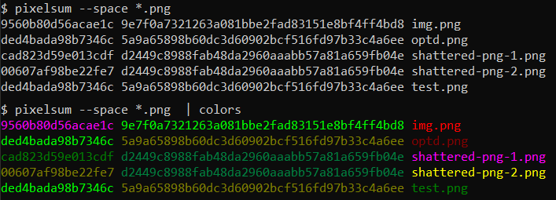

# colors

A small command that works as a pipe and colors words in random colors
(consistently coloring same words same colors), to make it easier to spot
same words in the output. E.g. to see potentially same values of some hash,
(example is my other tool [pixelsum](https://github.com/FRex/pixelsum)):

Go to releases for a 32-bit Windows exe (keep in mind 24-bit ANSI colors in
console require quite a recent Windows 10 version:
[link](https://devblogs.microsoft.com/commandline/24-bit-color-in-the-windows-console/)).
